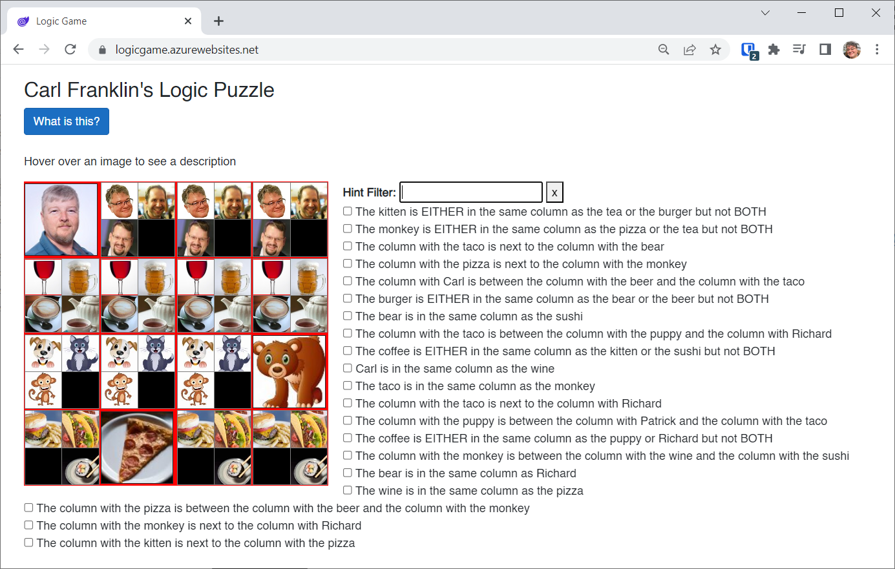
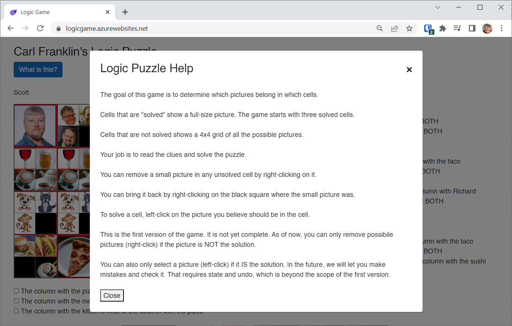
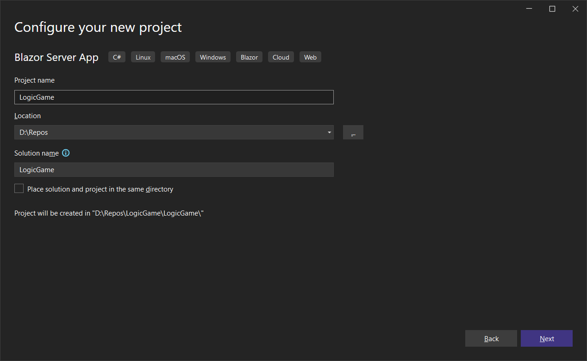
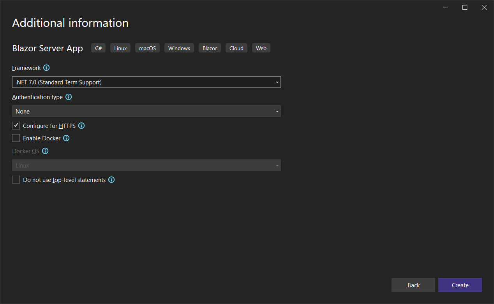
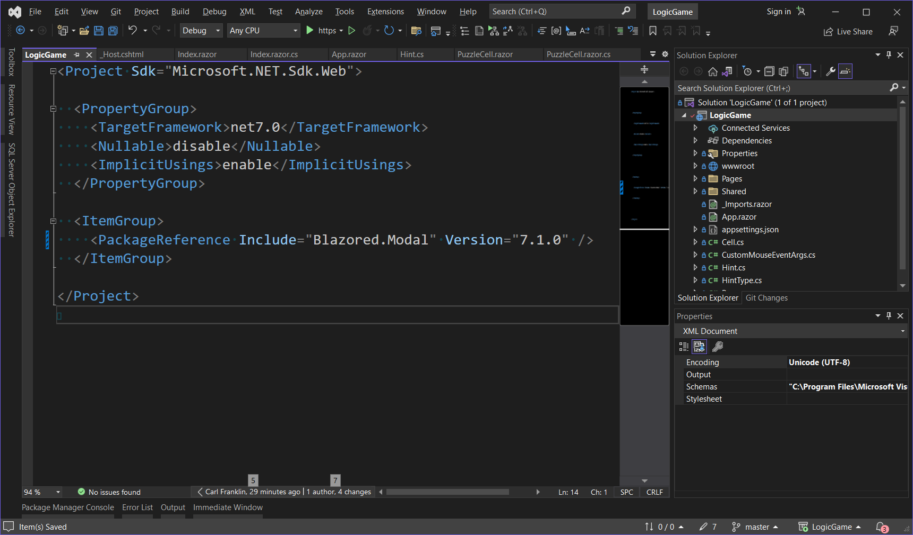
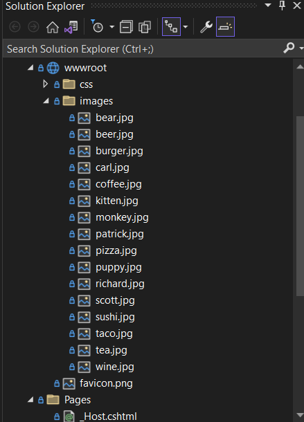
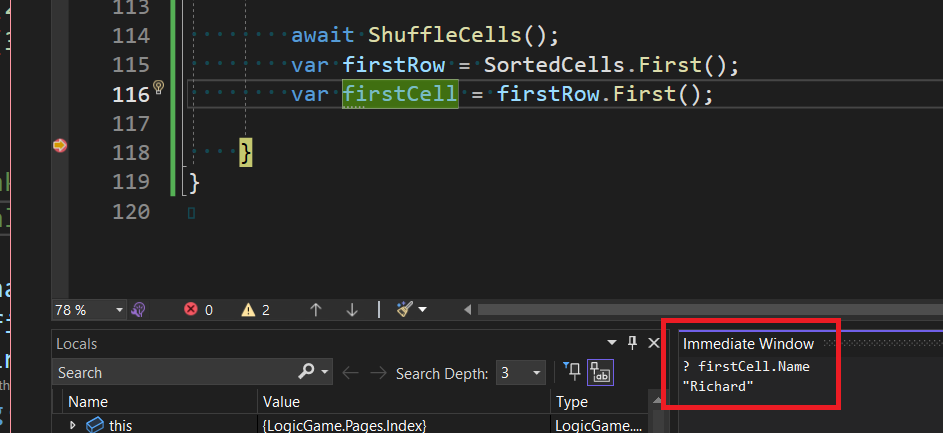

# Carl Franklin's Logic Puzzle

In this tutorial I will create a logic game where you have to solve a puzzle based on a series of clues and visual cues.

To play the game, go to https://logicgame.azurewebsites.net/

If you're new to the game, select the **What is this?** button for quick instructions.

If you prefer a video tutorial, watch [BlazorTrain episode 95: Building a Logic Puzzle Game](https://youtu.be/JHH6Xm7xyao)

This is what it looks like when you first run the app:



When you select the **What is this?** button, you'll see this help dialog:



Before you continue with the implementation, play the game a few times until it clicks. If you get stuck, watch the [BlazorTrain video](https://youtu.be/JHH6Xm7xyao).

Let's build this app!

Create a new `Blazor Server App` called **LogicGame**:




Select **.NET 7.0** as the Framework



Double click on the project file and add the following package:

```xml
<ItemGroup>
    <PackageReference Include="Blazored.Modal" Version="7.1.0" />
</ItemGroup>
```



We will use Blazored.Modal to display the Modal Help screen shown above.

Add the following to the top of *Program.cs*:

```c#
global using Blazored.Modal;
global using Blazored.Modal.Services;
```

and add the following at line 13:

```c#
builder.Services.AddBlazoredModal();
```

Add the following to *_Imports.razor*:

```
@using Blazored.Modal
@using Blazored.Modal.Services
```

Wrap the markup *App.razor* in a `<CascadingBlazoredModal>` like so:

```xml
<CascadingBlazoredModal>
    <Router AppAssembly="@typeof(App).Assembly">
        <Found Context="routeData">
            <RouteView RouteData="@routeData" DefaultLayout="@typeof(MainLayout)" />
            <FocusOnNavigate RouteData="@routeData" Selector="h1" />
        </Found>
        <NotFound>
            <PageTitle>Not found</PageTitle>
            <LayoutView Layout="@typeof(MainLayout)">
                <p role="alert">Sorry, there's nothing at this address.</p>
            </LayoutView>
        </NotFound>
    </Router>
</CascadingBlazoredModal>
```

### Add Models and Images

Add the following classes:

*Cell.cs*:

```c#
namespace LogicGame;

public class Cell
{
    /// <summary>
    /// The name that gets displayed when you hover over a picture in a cell
    /// </summary>
    public string Name { get; set; }

    /// <summary>
    /// The filename minus the path of the image file associated with this cell
    /// </summary>
    public string FileName { get; set; }

    /// <summary>
    /// The Index (0, 1, 2, or 3) of the image before shuffling
    /// </summary>
    public int Index { get; set; }

    /// <summary>
    /// 4 booleans in an array that represent whether the possible solutions
    /// are being shown. If they are all false, the cell is considered solved
    /// </summary>
    public bool[] Possibilities { get; set; }

    /// <summary>
    /// Returns true if all the possibilities are false
    /// </summary>
    /// <returns></returns>
    public bool IsSolved()
    {
        return Possibilities[0] == false
            && Possibilities[1] == false
            && Possibilities[2] == false
            && Possibilities[3] == false;
    }

    /// <summary>
    /// Sets all possibilities to false
    /// </summary>
    public void Solve()
    {
        Possibilities[0] = false;
        Possibilities[1] = false;
        Possibilities[2] = false;
        Possibilities[3] = false;
    }

    /// <summary>
    /// Constructor takes the name, filename, and index.
    /// It also initializes the possibilities
    /// </summary>
    /// <param name="name"></param>
    /// <param name="fileName"></param>
    /// <param name="index"></param>
    public Cell(string name, string fileName, int index)
    {
        Name = name;
        FileName = fileName;
        Index = index;
        Possibilities = new bool[] { true, true, true, true };
    }
}
```

The comments explain everything adequately except the `Index` property.

The app keeps two lists of cells: one in the original order and one that's shuffled.

The `Index` property represents the index in the original order, not shuffled.

> :point_up: The main UI is a 4x4 grid of cells: four rows and four columns. Each cell can be solved, showing the picture represented by the `FileName` property, or unsolved, showing one or more possibilities. 

#### Add Images

Download the images from the repo and copy them into your *wwwroot* folder, in an *images* subfolder:



You can use any images you like, actually. 

#### Let's clean up the template files

Delete the *Data* folder

Delete the *Pages/Counter.razor* and *Pages/FetchData.razor* files

Delete the *Shared/NavMenu.razor* file

Delete the *Shared/SurveyPrompt.razor* file

In *Program.cs* delete lines 3 and 12

```c#
using LogicGame.Data;
builder.Services.AddSingleton<WeatherForecastService>();
```

Modify *Shared/MainLayout.razor* as follows, removing the reference to the `NavMenu`:

```xml
@inherits LayoutComponentBase

<PageTitle>LogicGame</PageTitle>

<div class="page">
    <main>
        <article class="content px-4">
            @Body
        </article>
    </main>
</div>
```

Replace *Pages/Index.razor* with the following:

```
@page "/"
```

To the *Pages* folder, add the following code-behind class:

*Index.razor.cs*:

```c#
using Microsoft.AspNetCore.Components;

namespace LogicGame.Pages;

public partial class Index : ComponentBase
{
    protected string Message { get; set; } = "Carl Franklin's Logic Puzzle";
    protected string ImageHint { get; set; } = "Hover over an image to see a description";
    protected List<List<Cell>> SortedCells { get; set; } = new List<List<Cell>>();
    protected List<List<Cell>> Cells { get; set; } = new List<List<Cell>>();

    protected override async Task OnInitializedAsync()
    {
        var row1 = new List<Cell>
        {
            new Cell("Carl", "carl.jpg", 0),
            new Cell("Scott", "scott.jpg", 1),
            new Cell("Richard", "richard.jpg", 2),
            new Cell("Patrick", "patrick.jpg", 3)
        };
        Cells.Add(row1);

        var row2 = new List<Cell>
        {
            new Cell("the wine", "wine.jpg", 0),
            new Cell("the beer", "beer.jpg", 1),
            new Cell("the coffee", "coffee.jpg", 2),
            new Cell("the tea", "tea.jpg", 3)
        };
        Cells.Add(row2);

        var row3 = new List<Cell>
        {
            new Cell("the puppy", "puppy.jpg", 0),
            new Cell("the kitten", "kitten.jpg", 1),
            new Cell("the monkey", "monkey.jpg", 2),
            new Cell("the bear", "bear.jpg", 3)
        };
        Cells.Add(row3);

        var row4 = new List<Cell>
        {
            new Cell("the burger", "burger.jpg", 0),
            new Cell("the taco", "taco.jpg", 1),
            new Cell("the pizza", "pizza.jpg", 2),
            new Cell("the sushi", "sushi.jpg", 3)
        };
        Cells.Add(row4);
        
        await ShuffleCells();
    }
}
```

This is where we create the Cells.

The `Cells` list contains the cells in the order we added them here.

The `SortedCells` list is shuffled. 

We're going down a rabbit hole here, so stay with me.

Add the `ShuffleCells()` method:

```c#
protected async Task ShuffleCells()
{
    // Copy Cells
    SortedCells = Cells.ToArray().ToList();

    // objects to use and random seeds
    var obj1 = new object();
    var obj2 = new object();
    var obj3 = new object();
    var obj4 = new object();

    // shuffle
    var rnd = new Random(obj1.GetHashCode());
    SortedCells[0] = SortedCells[0].OrderBy(item => rnd.Next()).ToList();
    rnd = new Random(obj2.GetHashCode());
    SortedCells[1] = SortedCells[1].OrderBy(item => rnd.Next()).ToList();
    rnd = new Random(obj3.GetHashCode());
    SortedCells[2] = SortedCells[2].OrderBy(item => rnd.Next()).ToList();
    rnd = new Random(obj4.GetHashCode());
    SortedCells[3] = SortedCells[3].OrderBy(item => rnd.Next()).ToList();

    // pick 3 random cells to reveal by x and y
    var x1 = GetRandom();
    var x2 = GetRandom(new int[] { x1 });
    var x3 = GetRandom(new int[] { x1, x2 });
    var y1 = GetRandom();
    var y2 = GetRandom(new int[] { y1 });
    var y3 = GetRandom(new int[] { y1, y2 });

    // pull out lists of cells by the row
    var imageRow1 = SortedCells[y1 - 1];
    var imageRow2 = SortedCells[y2 - 1];
    var imageRow3 = SortedCells[y3 - 1];

    // solve the cells
    imageRow1[x1 - 1].Solve();
    imageRow2[x2 - 1].Solve();
    imageRow3[x3 - 1].Solve();

    // Make sure the cells are accurate
    //await UpdateGameState();

    // Generate Hints
    //GenerateHints();
}
```

OK, the next thing we need to add is the `GetRandom()` method.

```c#
protected int GetRandom(int[] notThese = null)
{
    // Get a random number with 1 as the lower bound and SortedCells count (typically 4) as the upper bound
    int result = RandomNumberGenerator.GetInt32(1, SortedCells.Count + 1);

    if (notThese == null)
        // No constraints. Return the number
        return result;

    // Keep generating until we get a number not in the specified array
    while (notThese.Contains(result))
        result = RandomNumberGenerator.GetInt32(1, SortedCells.Count + 1);

    // Done!
    return result;
}
```

The optional `int` array you can pass to `GetRandom()` is critical to picking unique random cells to display.

You can express "pick a random number between 1 and 4 (including 4) but not if it's one of the numbers in this array."

Let's add a couple lines of code after line 114:

```c#
await ShuffleCells();
var firstRow = SortedCells.First();
var firstCell = firstRow.First();
```

This code looks at the first row and the first cell in the first row of the SortedCells list.



Put  a breakpoint on line 118 and run the app.

Pull up the immediate window and type:

```c#
? firstCell.Name
```

Notice that it is not "Carl", which is the first cell in the first row we added to `Cells`, our non-shuffled list:

```c#
    var row1 = new List<Cell>
    {
        new Cell("Carl", "carl.jpg", 0),
        new Cell("Scott", "scott.jpg", 1),
        new Cell("Richard", "richard.jpg", 2),
        new Cell("Patrick", "patrick.jpg", 3)
    };
    Cells.Add(row1);
```

There's more code, but this is enough to get us started.

### Create a PuzzleCell razor component

The PuzzleCell component represents one of the 16 cells in the game (4 rows x 4 columns).

The goal in design is to encapsulate all the code and markup associated with a particular cell, and to leave all of the application scoped markup and code in the containing page (*Index.razor* and *Index.razor.cs*)

Add the following files to the *Shared* folder:

*PuzzleCell.razor*

```c#
@if (Cell.IsSolved())
{
     ShowImageName(Cell)"
         alt="@Cell.Name"
         src="images/@Cell.FileName"
         style="width:@BigCellWidth;border-width:1px;border-style:solid;" />
}
else
{
    <table>
        <tr>
            <td>
                @if (Cell.Possibilities[0])
                {
                     ShowOrHide(
                            new CustomMouseEventArgs(Cell, 0)))"
                         @oncontextmenu:preventDefault="true"
                         @onclick="() => ShowImage(Cell, 0)"
                         @onmouseover="() => ShowImageName(Cell, 0)"
                         src="@ImageFileName(Cell, 0)"
                         style="width:@SmallCellWidth;" />
                }
                else
                {
                    <div @oncontextmenu="@(() => ShowOrHide(
                            new CustomMouseEventArgs(Cell, 0)))"
                         @oncontextmenu:preventDefault="true"
                         @onmouseover="() => ShowImageName(Cell, 0)"
                         style="width:@SmallCellWidth;height:@SmallCellWidth;
                            background-color:black;" />
                }
            </td>
            <td>
                @if (Cell.Possibilities[1])
                {
                     ShowOrHide(
                            new CustomMouseEventArgs(Cell, 1)))"
                         @oncontextmenu:preventDefault="true"
                         @onclick="() => ShowImage(Cell, 1)"
                         @onmouseover="() => ShowImageName(Cell, 1)"
                         src="@ImageFileName(Cell, 1)"
                         style="width:@SmallCellWidth;" />
                }
                else
                {
                    <div @oncontextmenu="@(() => ShowOrHide(
                            new CustomMouseEventArgs(Cell, 1)))"
                         @oncontextmenu:preventDefault="true"
                         @onmouseover="() => ShowImageName(Cell, 1)"
                         style="width:@SmallCellWidth;height:@SmallCellWidth;
                            background-color:black;" />
                }
            </td>
        </tr>
        <tr>
            <td>
                @if (Cell.Possibilities[2])
                {
                     ShowOrHide(
                            new CustomMouseEventArgs(Cell, 2)))"
                         @oncontextmenu:preventDefault="true"
                         @onclick="() => ShowImage(Cell, 2)"
                         @onmouseover="() => ShowImageName(Cell, 2)"
                         src="@ImageFileName(Cell, 2)"
                         style="width:@SmallCellWidth;" />
                }
                else
                {
                    <div @oncontextmenu="@(() => ShowOrHide(
                            new CustomMouseEventArgs(Cell, 2)))"
                         @oncontextmenu:preventDefault="true"
                         @onmouseover="() => ShowImageName(Cell, 2)"
                         style="width:@SmallCellWidth;height:@SmallCellWidth;
                            background-color:black;" />
                }
            </td>
            <td>
                @if (Cell.Possibilities[3])
                {
                     ShowOrHide(
                            new CustomMouseEventArgs(Cell, 3)))"
                         @oncontextmenu:preventDefault="true"
                         @onclick="() => ShowImage(Cell, 3)"
                         @onmouseover="() => ShowImageName(Cell, 3)"
                         src="@ImageFileName(Cell, 3)"
                         style="width:@SmallCellWidth;" />
                }
                else
                {
                    <div @oncontextmenu="@(() => ShowOrHide(
                            new CustomMouseEventArgs(Cell, 3)))"
                         @oncontextmenu:preventDefault="true"
                         @onmouseover="() => ShowImageName(Cell, 3)"
                         style="width:@SmallCellWidth;height:@SmallCellWidth;
                            background-color:black;" />
                }
            </td>
        </tr>
    </table>
}
```

Before we even get this working, take a look at the markup here. 

If the puzzle is solved, we simply show the image.

Otherwise, we're creating a table WITHIN the cell containing 4 sub cells, one for each possible image.

Remember that a cell is in a particular category: people, beverages, pets, or food. So, each cell can be one of those four items.

Our code will have helper methods to handle the state of each of these images (shown or not shown), which requires getting their names and filenames.

In each of the table sub cells, we need to know if the possibilities are set to true for a given index. If it is, we show the small image, otherwise we show a black div in its place.

OK, let's add the code-behind:

*PuzzleCell.razor.cs*:

```c#
using Microsoft.AspNetCore.Components;

namespace LogicGame.Shared;

/// <summary>
/// PuzzleCell represents the UI around a single cell
/// </summary>
public partial class PuzzleCell: ComponentBase
{
    /// <summary>
    /// The cell being represented
    /// </summary>
    [Parameter]
    public Cell Cell { get; set; }

    /// <summary>
    /// The sorted cells provided by the application
    /// </summary>
    [Parameter]
    public List<List<Cell>> SortedCells { get; set; } 
        = new List<List<Cell>>();

    /// <summary>
    /// The list of unsorted cells provided by the application
    /// </summary>
    [Parameter]
    public List<List<Cell>> Cells { get; set; } 
        = new List<List<Cell>>();

    /// <summary>
    /// Event fired when the user hovers over a cell image
    /// </summary>
    [Parameter]
    public EventCallback<string> ImageHintChanged { get; set; }

    /// <summary>
    /// Event fired when a cell changes so the app can update the UI
    /// </summary>
    [Parameter]
    public EventCallback<Cell> CellChanged { get; set; }

    /// <summary>
    /// Cell Size (square) provided by the application
    /// </summary>
    [Parameter]
    public string BigCellWidth { get; set; }

    /// <summary>
    /// Interior (small) cell size provided by the application
    /// </summary>
    [Parameter]
    public string SmallCellWidth { get; set; }

    /// <summary>
    /// Helper method to raise ImageHintChanged event
    /// </summary>
    /// <param name="cell"></param>
    /// <param name="index">If -1, we can use the cell name, 
    /// otherwwise we use the name of one of the small images
    /// </param>
    /// <returns></returns>
    protected async Task ShowImageName(Cell cell, int index = -1)
    {
        if (index == -1)
            // Use the cell name
            await ImageHintChanged.InvokeAsync(cell.Name);
        else
        {
            // Get the name of the small image by index
            var name = ImageName(cell, index);
            await ImageHintChanged.InvokeAsync(name);
        }
    }

    /// <summary>
    /// Helper method to get the image name given the index
    /// which is 0, 1, 2, or 3
    /// </summary>
    /// <param name="cell"></param>
    /// <param name="index"></param>
    /// <returns></returns>
    protected string ImageName(Cell cell, int index)
    {
        // find this cell's parent list in Sorted Cells
        var imagesRows = (from x in SortedCells 
                          where x.Contains(cell) select x).ToList();

        // Get the row index
        var rowIndex = SortedCells.IndexOf(imagesRows.First());

        // Get the cells in the un-sorted list at this index
        var cells = Cells[rowIndex];

        // use the column to retrieve the original image file name
        string result = cells[index].Name;

        return result;
    }

    /// <summary>
    /// Helper name to get the filename of a smaller image
    /// given the index which is 0, 1, 2, or 3
    /// </summary>
    /// <param name="cell"></param>
    /// <param name="index"></param>
    /// <returns></returns>
    protected string ImageFileName(Cell cell, int index)
    {
        // find this cell's parent list in Sorted Cells
        var imagesRows = (from x in SortedCells 
                          where x.Contains(cell) select x).ToList();
        
        // Get the row index
        var rowIndex = SortedCells.IndexOf(imagesRows.First());

        // Get the cells in the un-sorted list at this index
        var cells = Cells[rowIndex];

        // use the column to retrieve the original image file name
        string result = $"images/{cells[index].FileName}";

        return result;
    }

    /// <summary>
    /// Helper method to show or hide one of the smaller images
    /// using a custome CellMouseEventArgs class, which contains
    /// both a cell and a small image index
    /// </summary>
    /// <param name="args"></param>
    /// <returns></returns>
    protected async Task ShowOrHide(CellMouseEventArgs args)
    {
        var cell = args.Cell;

        // are we de-selecting a possibility?
        if (cell.Possibilities[args.ImageIndex])
        {
            // Make sure this is NOT the solution image
            string imageName = ImageFileName(cell, args.ImageIndex);
            if (imageName.Contains(cell.FileName))
                return;
        }

        // Switch
        cell.Possibilities[args.ImageIndex] = 
            !cell.Possibilities[args.ImageIndex];

        // Notify the UI
        await CellChanged.InvokeAsync(cell);
    }

    /// <summary>
    /// Helper method to solve a cell and update the UI
    /// </summary>
    /// <param name="cell"></param>
    /// <param name="index"></param>
    /// <returns></returns>
    protected async Task SolveCellAndNotify(Cell cell, int index)
    {
        // Only solve if the index matches the correct answer
        if (cell.Index == index)
        {
            cell.Solve();
            await CellChanged.InvokeAsync(cell);
        }
    }
}
```

Add the following class to the project, as our component code needs it.

*CellMouseEventArgs.cs*:

```c#
using Microsoft.AspNetCore.Components.Web;

namespace LogicGame;

/// <summary>
/// Combines a cell and an image index
/// </summary>
public class CellMouseEventArgs : MouseEventArgs
{
    public CellMouseEventArgs(Cell cell, int imageIndex)
    {
        Cell = cell;
        ImageIndex = imageIndex;
    }

    public int ImageIndex { get; set; }
    public Cell Cell { get; }
}
```

There's a lot to unpack here. The comments should be self-explanatory. Read through them to understand how it works.

### Application Markup and Code

Now we can focus on the application code (*Index.razor* and *Index.razor.cs*) that handles game layout and logic.

Add the following class:

*Hint.cs*:

```c#
namespace LogicGame;

/// <summary>
/// Hints are shown on the main page, and generated by the app code.
/// </summary>
public class Hint
{
    /// <summary>
    /// Only 4 hint types are implemented.
    /// </summary>
    public HintType Type { get; set; }
    
    /// <summary>
    /// The text displayed on the page
    /// </summary>
    public string HintText { get; set; } = string.Empty;

    /// <summary>
    /// All of the cells involved in this hint
    /// </summary>
    public List<Cell> Cells { get; set; } = new List<Cell>();

    /// <summary>
    /// A courtesy to let the user check off hints already processed.
    /// </summary>
    public bool Checked { get; set; } = false;

    /// <summary>
    /// This is important. We don't want to create multiple hints
    /// of the same type involving the same cells.
    /// It's called from GenerateSameColumnClue() using LINQ
    /// </summary>
    /// <param name="cells"></param>
    /// <returns>returns true if the cells involved are already
    /// being used.</returns>
    public bool ContainsCells(List<Cell> cells)
    {
        int matchCount = 0;
        foreach (var cell in cells)
        {
            var match = (from x in Cells 
                         where x.Name == cell.Name 
                         select x).FirstOrDefault();
            if (match != null)
                matchCount++;
        }
        return (matchCount == cells.Count);
    }
}
```

Add the HintType enum:

*HintType.cs*:

```c#
namespace LogicGame;

public enum HintType
{
    SameColumn,
    NotSameColumn,
    NextTo,
    NotNextTo,
    Between,
    NotBetween,
    ThisNotThat
}
```

#### JavaScript

We need JavaScript to set the focus to the hint filter input tag and also for the confetti flourish at the end which I got from https://www.codehim.com/animation-effects/javascript-confetti-explosion-effect/

Add the following script tag to the *_Host.cshtml* file at line 34:

```java
<script>
    window.SetFocus = (id) =>{
        setTimeout(setFocus, 10, id);
    }
    function setFocus(id)
    {
        var elem = document.getElementById(id);
        if (elem == null)
        {
            setTimeout(setFocus, 10, id);
            return;
        }
        elem.focus();
        elem.select();
    }

    window.ExplodeConfetti = () => {
        initConfetti();
        render();
    }

    var canvas;
    var ctx;
    var cx;
    var cy;

    let confetti = [];
    const confettiCount = 100;
    const gravity = 0.5;
    const terminalVelocity = 5;
    const drag = 0.075;
    const colors = [
        { front: 'red', back: 'darkred' },
        { front: 'green', back: 'darkgreen' },
        { front: 'blue', back: 'darkblue' },
        { front: 'yellow', back: 'darkyellow' },
        { front: 'orange', back: 'darkorange' },
        { front: 'pink', back: 'darkpink' },
        { front: 'purple', back: 'darkpurple' },
        { front: 'turquoise', back: 'darkturquoise' }];

    //-----------Functions--------------
    function resizeCanvas() {
        canvas.width = window.innerWidth;
        canvas.height = window.innerHeight;
        cx = ctx.canvas.width / 2;
        cy = ctx.canvas.height / 2;
    };

    randomRange = (min, max) => Math.random() * (max - min) + min;

    function initConfetti() {
        canvas = document.getElementById("canvas");
        ctx = canvas.getContext("2d");
        canvas.width = window.innerWidth;
        canvas.height = window.innerHeight;
        cx = ctx.canvas.width / 2;
        cy = ctx.canvas.height / 2;

        for (let i = 0; i < confettiCount; i++) {
            confetti.push({
                color: colors[Math.floor(randomRange(0, colors.length))],
                dimensions: {
                    x: randomRange(10, 20),
                    y: randomRange(10, 30)
                },

                position: {
                    x: randomRange(0, canvas.width),
                    y: canvas.height - 1
                },

                rotation: randomRange(0, 2 * Math.PI),
                scale: {
                    x: 1,
                    y: 1
                },

                velocity: {
                    x: randomRange(-25, 25),
                    y: randomRange(0, -50)
                }
            });


        }
    };

    //---------Render-----------
    function render() {
        ctx.clearRect(0, 0, canvas.width, canvas.height);

        confetti.forEach((confetto, index) => {
            let width = confetto.dimensions.x * confetto.scale.x;
            let height = confetto.dimensions.y * confetto.scale.y;

            // Move canvas to position and rotate
            ctx.translate(confetto.position.x, confetto.position.y);
            ctx.rotate(confetto.rotation);

            // Apply forces to velocity
            confetto.velocity.x -= confetto.velocity.x * drag;
            confetto.velocity.y = Math.min(confetto.velocity.y + gravity, terminalVelocity);
            confetto.velocity.x += Math.random() > 0.5 ? Math.random() : -Math.random();

            // Set position
            confetto.position.x += confetto.velocity.x;
            confetto.position.y += confetto.velocity.y;

            // Delete confetti when out of frame
            if (confetto.position.y >= canvas.height) confetti.splice(index, 1);

            // Loop confetto x position
            if (confetto.position.x > canvas.width) confetto.position.x = 0;
            if (confetto.position.x < 0) confetto.position.x = canvas.width;

            // Spin confetto by scaling y
            confetto.scale.y = Math.cos(confetto.position.y * 0.1);
            ctx.fillStyle = confetto.scale.y > 0 ? confetto.color.front : confetto.color.back;

            // Draw confetto
            ctx.fillRect(-width / 2, -height / 2, width, height);

            // Reset transform matrix
            ctx.setTransform(1, 0, 0, 1, 0, 0);
        });

        // Fire off another round of confetti
        //if (confetti.length <= 10) initConfetti();

        window.requestAnimationFrame(render);
    };

</script>
```

Create the Help Modal. Add the following file to the *Shared* folder:

*HelpModal.razor*:

```c#
<div>
    The goal of this game is to determine which pictures belong in which cells.
    <br />
    <br />
    Cells that are "solved" show a full-size picture. The game starts with three solved cells.
    <br />
    <br />
    Cells that are not solved shows a 4x4 grid of all the possible pictures.
    <br />
    <br />
    Your job is to read the clues and solve the puzzle.
    <br />
    <br />
    You can remove a small picture in any unsolved cell by right-clicking on it.
    <br />
    <br />
    You can bring it back by right-clicking on the black square where the small picture was.
    <br />
    <br />
    To solve a cell, left-click on the picture you believe should be in the cell.
    <br />
    <br />
    This is the first version of the game. It is not yet complete. As of now, you can only
    remove possibile pictures (right-click) if the picture is NOT the solution.
    <br />
    <br />
    You can also only select a picture (left-click) if it IS the solution. In the future,
    we will let you make mistakes and check it. That requires state and undo, which is beyond
    the scope of the first version.
    <br />
    <br />

</div>
<button @onclick="Close">Close</button>

@code {

    [CascadingParameter]
    BlazoredModalInstance BlazoredModal { get; set; } = default!;

    private async Task Close() => await BlazoredModal.CloseAsync();
}
```

